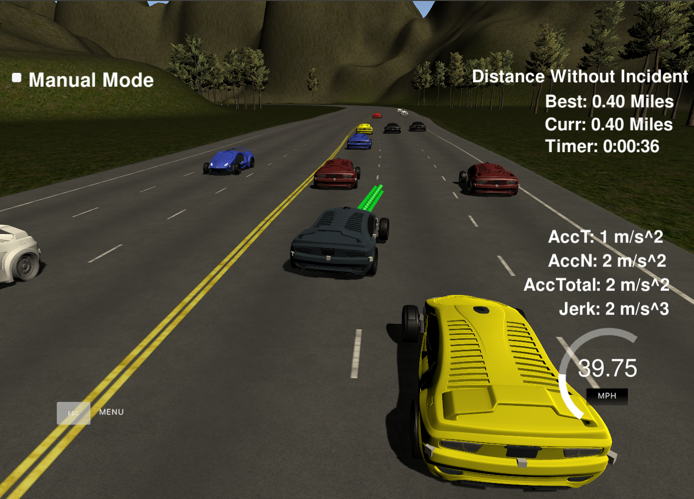
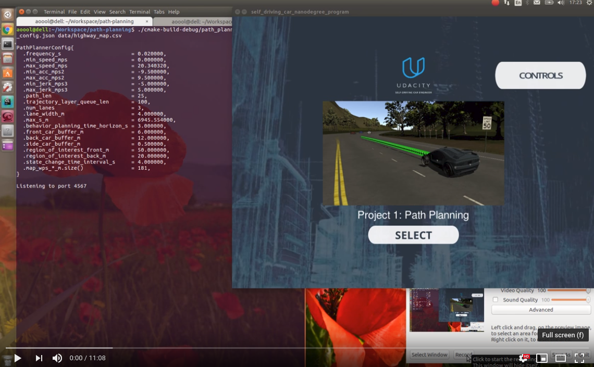

## Path Planning (Self-Driving Car Engineer Nanodegree)
In this project, the highway path planner is designed that is responsible for generating smooth jerk-minimizing 
trajectories that guide the car with the average velocity higher than that of the surrounding cars. The car
behaves very much like a real driver who is in a hurry but does not want to violate the speed limit and safety rules. 
The path planner is capable of planing lane changes to place a car in the best lane concerning
the long-term progress, that is, the more distance traveled within a matter of several tens of seconds, the better.
The best lane to be in is determined by several heuristics.

This project involves the Udacity Self-Driving Car Engineer Nanodegree Term 3 Simulator 
which can be downloaded from [here](https://github.com/udacity/self-driving-car-sim/releases/tag/T3_v1.2).
   
#### Dependencies

* cmake >= 3.5
  * All OSes: [click here for installation instructions](https://cmake.org/install/)
* make >= 4.1
  * Linux: make is installed by default on most Linux distros
  * Mac: [install Xcode command line tools to get make](https://developer.apple.com/xcode/features/)
  * Windows: [Click here for installation instructions](http://gnuwin32.sourceforge.net/packages/make.htm)
* gcc/g++ >= 8.1
  * Linux: gcc / g++ is installed by default on most Linux distros, but you may need to update g++ to the latest
    one to successfully compile the project.
  * Mac: same deal as make - [install Xcode command line tools]((https://developer.apple.com/xcode/features/)
  * Windows: recommend using [MinGW](http://www.mingw.org/)
* [uWebSockets](https://github.com/uWebSockets/uWebSockets)
  * Run either `install-mac.sh` or `install-ubuntu.sh`.
  * If you install from source, checkout to commit `e94b6e1`, i.e.
    ```
    git clone https://github.com/uWebSockets/uWebSockets 
    cd uWebSockets
    git checkout e94b6e1
    ```

#### Build
The path planner program can be built by doing the following from the project top directory.

```bash
$> mkdir build
$> cd build
$> cmake ..
$> make
```

#### Run
The path planner program can be run by doing the following from the project top directory.
```bash
$> build/path_planning
```

#### Demo

###### Photo


###### Video
[](https://youtu.be/dZDU_c_08rk)

#### Goals
The goal of this project is to safely navigate around a virtual highway with other traffic that is driving 
about the 50 MPH speed limit. The car's localization and sensor fusion data is provided by the simulator.
There is also a sparse map list of waypoints around the highway (see  in [data/highway_map.csv](./data/highway_map.csv). 
The car should try to go as close as possible to the 50 MPH speed limit, 
which means passing slower traffic when possible. The other cars will try to change lanes too. 
The car should avoid hitting other cars at all cost as well as driving inside of the marked road lanes at all times, 
unless going from one lane to another. The car should be able to make one complete loop around the 6945.554 m highway. 
Since the car is trying to go 50 MPH, it should take a little over 5 minutes to complete 1 loop. 
Also the car should not experience total acceleration over 10 m/s^2 and jerk that is greater than 10 m/s^3.

#### The map of the highway is in data/highway_map.txt
Each waypoint in the list contains  [x,y,s,dx,dy] values. 
x and y are the waypoint's map coordinate position, 
the s value is the distance along the road to get to that waypoint in meters, 
the dx and dy values define the unit normal vector pointing outward of the highway loop.

The highway's waypoints loop around so the frenet s value, distance along the road, goes from 0 to 6945.554.


#### Main car's localization Data (No Noise)

["x"] The car's x position in map coordinates

["y"] The car's y position in map coordinates

["s"] The car's s position in frenet coordinates

["d"] The car's d position in frenet coordinates

["yaw"] The car's yaw angle in the map

["speed"] The car's speed in MPH

#### Previous path data given to the Planner

["previous_path_x"] The previous list of x points previously given to the simulator

["previous_path_y"] The previous list of y points previously given to the simulator

#### Previous path's end s and d values 

["end_path_s"] The previous list's last point's frenet s value

["end_path_d"] The previous list's last point's frenet d value

#### Sensor Fusion Data, a list of all other car's attributes on the same side of the road. (No Noise)

["sensor_fusion"] A 2d vector of cars and then that car's 
[
  car's unique ID, 
  car's x position in map coordinates, 
  car's y position in map coordinates, 
  car's x velocity in m/s, 
  car's y velocity in m/s, 
  car's s position in frenet coordinates, 
  car's d position in frenet coordinates
]. 

#### Details

1. The car uses a perfect controller and visits every (x,y) point it receives in the list every 0.02 seconds. 
The units for the (x,y) points are in meters, and the spacing of the points determines the speed of the car. 
The vector going from a point to the next point in the list dictates the angle of the car. 
Acceleration both in the tangential and normal directions is measured along with the jerk, 
the rate of change of total acceleration. 
The (x,y) point paths that the planner receives should not have a total acceleration that goes over 10 m/s^2. 
Also, the jerk should not go over 10 m/s^3. 

2. There is some latency between the simulator running and the path planner returning a path, 
with optimized code usually it is not very long maybe just 1-3 time steps. 
During this delay, the simulator continues using points that it was last given.

#### Code Overview

The architecture can be schematically represented as follows.
``` 
        |--------------------------------------|  
        |              Behavior Layer          |  
        |--------------------------------------|  
                ^                     |
                |                     v
      |--------------------|   |-------------------|
      | Prediction Layer   |-> | Trajectory Layer  |  
      |--------------------|   |-------------------|
                ^                     |
                |                     |
      |--------------------|          |
      | Localization Layer |          | [ car{s_1,d_1,vs_1,vd_1,as_1,ad_1,t_1}, 
      |--------------------|          |                  ...
               ^                      |   car{s_n,d_n,vs_n,vd_n,as_n,ad_n,t_n} ]
 sensor fusion |                      v
           |------------------------------|
           |         Path Planner         |
           |------------------------------|
                  ^              | X/Y trajectories
    sensor fusion |              v
               |----------------------|
               |      Simulator       |
               |----------------------|    
```

There is a class `Car` defined in [src/car.hpp](src/car.hpp) and [src/car.cpp](src/car.cpp) which is used in almost
every other program file. `Car` objects contain information about the Frenet coordinates S and D, Frenet velocities 
Vs and Vd, Frenet accelerations As and Ad, time, car ID, and other. 

The file [src/main.cpp](./src/main.cpp) contains the code to communicate with the simulator and also code that
reads configuration files, such as highway map and configuration file containing various settings for the path planner.
One can think of this as a `Simulator`, although, this is an intermediate layer between the path planner and 
the `Simulator`, but this exact notion only complicates understanding and brings zero value.

The `Path Planner` is defined in [src/path_planner.hpp](./src/path_planner.hpp) and 
[src/path_planner.cpp](./src/path_planner.cpp). It is responsible for accepting the sensor fusion information and
forwarding it to the `Localization Layer`. It also retrieves car trajectory information in the form of an array
of `Car` objects for the successive points in time, this is, a planned trajectory, and converts it into 
X and Y trajectories in the Cartesian frame. Then it gives this X/Y trajectories to the simulator.

The `Localization Layer` is defined in [src/localization_layer.hpp](src/localization_layer.hpp) and 
[src/localization_layer.cpp](src/localization_layer.cpp) files and is supposed to substitute a real logic
that generates sensor fusion information. Since this information is already available from the `Simulator`,
`Localization Layer` only plays a role of converter from array-based car representation (provided by the `Simulator`) 
to the `Car`-based car representation.

The `Prediction Layer` is defined in [src/prediction_layer.hpp](src/prediction_layer.hpp) and 
[src/prediction_layer.cpp](src/prediction_layer.cpp) files and is responsible for predicting the surrounding
cars positions at some time in the future. It relies on the assumption that the surrounding cars do not change their 
lanes and move with constant velocities. Although it is not exactly true, and some cars might change their lanes 
and slightly variate their velocities, it happens so rarely that it is not needed to utilize a
more complicated motion model. There is a collision avoidance mechanism in `Trajectory Layer` that handles
unexpected lane changes and major velocity variations of the surrounding cars.

The `Behavior Layer` is defined in [src/behavior_layer.hpp](src/behavior_layer.hpp) and 
[src/behavior_layer.cpp](src/behavior_layer.cpp) files and it responsible for "higher-level thinking" of the car.
Taking into consideration the predictions provided by the `Prediction Layer`, it plans the next position of the car 
sometime in the future for each possible next car state. It then weights all the planned cars and chooses the
one having the lowest cost.

Since the `Behavior Layer` is the most interesting component of the path planner, it worth diving a bit deeper into its
structure. There are three states that a `Car` object can be in---*KeepLane*, *LaneChangeLeft*, and *LaneChangeRight*.
For each possible next state for the `Car` object, `Behavior Layer` constructs future `Car` objects considering 
the positions and velocities of the surrounding cars. For *KeepLane* state it
plans to position the ego car slightly behind the car ahead. If there is no car ahead, it just sets to car's velocity
to a justified maximum velocity and plans car's position accordingly. For *LaneChange*\* state, the `Behavior Layer`
plans to position the ego car slightly behind the other car in an intended 
lane that currently violates its safety buffer. If no car
violates the safety buffer of the ego car, the `Behavior Layer` sets the car's velocity to a justified 
maximum and plans accordingly. The described procedure is a bit simplified; the code considers more subtleties.

For choosing the best planned `Car` object, the `Behavior Layer` utilize the following cost functions:  
- the farther the distance to the other car ahead in the ego car's lane, the better;
- the higher the velocity of the other car ahead in the ego car's lane, the better;
- the larger longitudinal distance between the current ego car and the planned ego car, the better;
- given the alternatives, the car should not stay in the rightmost lane because simulator might falsely 
declare the car out of the lane.  (It is a workaround needed to cover differences in the `Simulator`'s method of 
  conversion between Cartesian and Frenet coordinates and the method implemented in the path planner.)

The `Trajectory Layer` is defined in [src/trajectory_layer.hpp](src/trajectory_layer.hpp) and 
[src/trajectory_layer.cpp](src/trajectory_layer.cpp) files and is responsible for generating a jerk-minimizing 
trajectory between the current `Car` object and the `Car` object planned by the `Behavior Layer` 
and for collision avoidance. The `Trajectory Layer` maintains its 
array of trajectory `Car` objects (points) generated during
previous iterations. This array (buffer) is larger than the one maintained by the `Path Planner`. 
It allows to keep a planned trajectory for a couple of seconds in the future and avoid execution of
all the code involved into the planning of the next `Car` object each time the information exchange 
between the `Path Planner` and the `Simulator` happens. 

The X/Y trajectories in the `Path Planner` cannot be changed.
The length of X/Y trajectory, this is, the duration of time, in the `Path Planner` is comparable 
to the smallest human drivers reaction time. The `Trajectory Layer` keeps much 
longer trajectory, and, if there is an unexpected
obstacle ahead, it forgets all the planned trajectory and asks the `Behavior Layer` to re-plan the future car position
given the new circumstances. The `Behavior Layer` "thinks" about 0.1 seconds before producing the future `Car` object
but it is several times smaller than the duration of time of a trajectory that is kept in the `Path Planner`.

#### Possible Improvements
The path planner works very stable and makes the car behave almost like a real driver. However, there are still
possible improvements that can improve the driving even more:
- Include the *PrepareLaneChangeLeft* and *PrepareLaneChangeRight* states to the car to handle situations like the
one on the picture below. There is a car ahead that moves with constant velocity. 
Also, there is a car behind in the neighboring lane that moves with the same velocity. 
For such a case, the path planned keeps the ego
following the car ahead forever, until there is enough room to change lane. 
While human driver that, in this case, would considerably lower the speed and change two lanes. 
Luckily, in real life and the Udacity simulator, such situations are very uncommon.

```
(1)
====================================================================
                                    v                        v
                        | ego car |--->        | car ahead |--->

--------------------------------------------------------------------
                               v
                | car behind |--->

--------------------------------------------------------------------


====================================================================


(2)
====================================================================
                                                                v
                                                  | car ahead |--->

--------------------------------------------------------------------
            v-dv                   v
| ego car |--->     | car behind |---> 

--------------------------------------------------------------------


====================================================================


(3)
====================================================================
                                                             v
                                               | car ahead |--->

--------------------------------------------------------------------
                               v
                | car behind |--->

--------------------------------------------------------------------
                                                         v_max
                                             | ego car |--->

====================================================================
```

- The `Trajectory Layer` should vary the planned `Car` object's S and D positions and the planning time horizon 
following Gaussian distribution. Then it should evaluate all the trajectories and choose the one that meets
all the constraints, like in 
M. Werling, J. Ziegler, S. Kammel, and S. Thrun, 
"Optimal trajectory generation for dynamic street scenarios in a Frenét Frame," 
2010 IEEE International Conference on Robotics and Automation, Anchorage, AK, 2010, pp. 987-993.
It may allow increasing the maximum speed allowed by 2-3 miles per hour.
